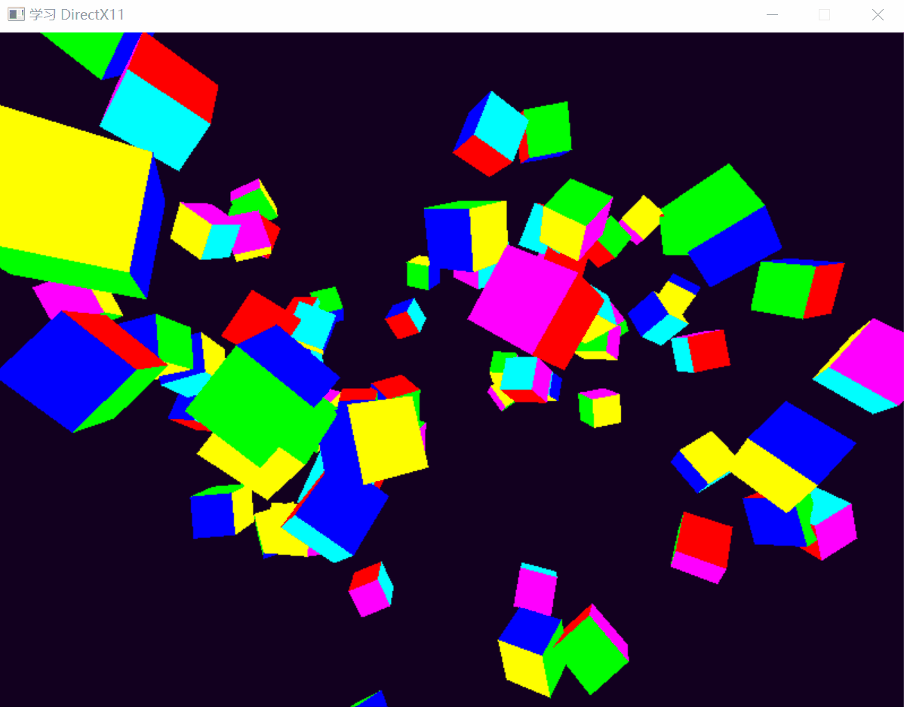

# 学习 DirectX 11

跟着 [ChiliTomatoNoodle](https://www.youtube.com/c/ChiliTomatoNoodle) 的 [C++ 3D DirectX Programming](https://www.youtube.com/playlist?list=PLqCJpWy5Fohd3S7ICFXwUomYW0Wv67pDD) 学习 DirectX 11。

目前跟到 P23。

# 参考
* [【人工听译】Directx3D11入门详细教程](https://www.bilibili.com/video/BV1KC4y1Y7tc)
* [《DirectX 12 3D 游戏开发实战》](https://book.douban.com/subject/30426701/)
    * 异步社区上买了电子书，微信读书上也有电子版。
* [图形编程](https://enjoyphysics.cn/Soft/NotXNA)
    * 一个中学物理老师翻译的 DX11龙书，内容在博客中。
* [DirectX11 With Windows SDK教程演示项目](https://github.com/MKXJun/DirectX11-With-Windows-SDK)

